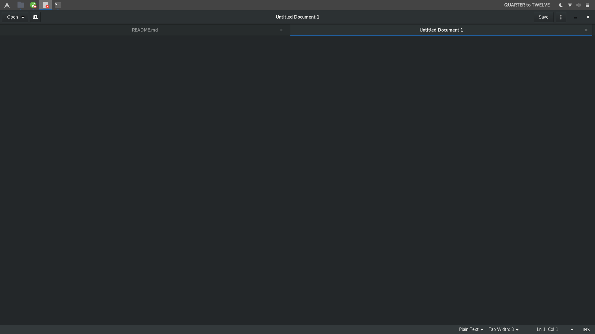

# Fuzzy Clock
Replace the Gnome Shell clock with a Fuzzy clock.



# Install
## [Gnome Software](appstream://fuzzy-clock_keepawayfromfire.co.uk)
```
appstream://fuzzy-clock_keepawayfromfire.co.uk
```
## [Gnome Extensions](https://extensions.gnome.org/extension/1281/fuzzy-clock/)
## GIT
```
git clone https://github.com/Cj-Malone/Fuzzy-Clock ${XDG_DATA_HOME:=$HOME/.local/share}/gnome-shell/extensions/fuzzy-clock@keepawayfromfire.co.uk/
```
## Arch Linux
```
cd $(mktemp -d)
curl https://gitlab.com/Cj-Malone/PKGBUILDs/raw/master/aur/gnome-shell-extension-fuzzy-clock/PKGBUILD > PKGBUILD
makepkg
sudo pacman -U gnome-shell-extension-fuzzy-clock-*-any.pkg.tar
```

